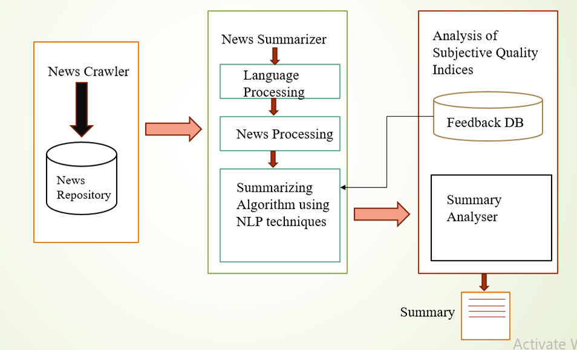

# Text-Summarization-with-Flask

  

To compare the Summarized results of an Online Article using "Word Ranking Algorithm" and a function "summarize" of 'Gensim' Package.

<b>Step -I:</b>This is the "Extraction based summarization". Here, only the important sentences will be identified and they can be re-ordered to get the summary of the entire content. It's usage may be limited to some extent.
	 
	
<ol>
 	 <li> Import packages such as -  "Beautiful Soup (bs4), requests, regular expressions (re), Natural Language Tool Kit (nltk), heapq, gensim, Flask"</il>
	<li> Web Scraping is done to Extract the content from the web page using   bs4, requests</il>
	 
	<li> Scraping is achieved by understanding the style of the web page</il>
	 
	<li> Text Cleaning of an Article is done by making use of (re) package</il>
	 
	<li> To process the text of an article, we use (nltk) package there by partitioning the entire content into sentences and words</il>
	 
	<li> Stop words removal is done making use of "stopwords" of (nltk) </il>
	 
	<li> We calculate the frequency of each unique valid word within the entire content </il>
	 
	<li> We calculate the word-frequency or word-score making use of ratio between unique word frequency and max frequency of word within the content </il>
	 
	<li> We calculate the Sentence-score by summing up valid word-scores for every sentence </il>
	 
  	<li> All the sentences are sorted in descending order by the sentence-score using (heapq) package </il>
	 
  	<li> We can Obtain the Summary by joining the required number of sentences together </il>
	</ol>
	

Step -II: Here, we use the "summarize" function of the gensim package { First 6 steps are same as that of Step  -I}
    Now, the processed content is provided as parameter to the summarize function. We can obtain the summary based on the ratio that is to be provided as the parameter to the summarize function.

Web Development:  We use the "Flask" to deploy the application which runs on localhost 5000.

Results: We can Compare the results of the two methods to understand the implementation of the Text based Summarization.

Packges used in this project are:
1. <a href="https://www.python.org/downloads/" > Python 3.6 </a>
2. <a href="http://flask.pocoo.org/"> Flask 1.0.2 </a>
3. <a href="https://radimrehurek.com/gensim/"> Gensim </a>
4. <a href="https://pypi.org/project/bs4/"> bs4 </a>
5. <a href="https://www.nltk.org/install.html"> NLTK </a>

  

