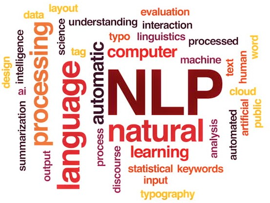

# Text-Summarization-with-Flask

  

Text summarization refers to the technique of shortening long pieces of text. The intention is to create a coherent and fluent summary having only the main points outlined in the document. Automatic text summarization is a common problem in machine learning and natural language processing (NLP). Machine learning models are usually trained to understand documents and distill the useful information before outputting the required summarized texts. 

Packges used in this project are:
1. <a href="https://www.python.org/downloads/" > Python 3.6 </a>
2. <a href="http://flask.pocoo.org/"> Flask 1.0.2 </a>
3. <a href="https://radimrehurek.com/gensim/"> Gensim </a>
4. <a href="https://pypi.org/project/bs4/"> bs4 </a>
5. <a href="https://www.nltk.org/install.html"> NLTK </a>

  

